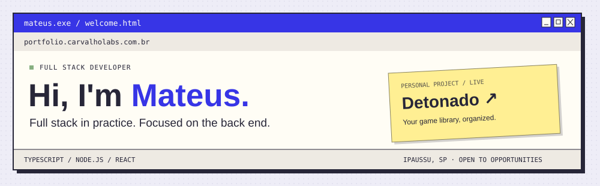

  <a href="#english">English</a> · <a href="#portugues">Português</a> ·
  <a href="https://portfolio.carvalholabs.com.br/">Portfolio ↗</a> ·
  <a href="https://www.linkedin.com/in/mateuscarvalho47/">LinkedIn ↗</a>

## `01 / about.txt`

Hi! I'm **Mateus**, a Full Stack Developer from Ipaussu, São Paulo, Brazil, with over two years of experience working on production web applications.

I started in **ERP technical support**, investigating incidents in SQL Server and talking to the people using the software. That experience shapes how I develop: understand the problem and business rules before proposing a solution.

At **Grupo Carvalho**, I worked on vehicle auctions, vehicle yard management, and financial systems, from data modeling through deployment. My main stack is **TypeScript, Node.js, React, Next.js, and PostgreSQL**, with a focus on the back end.

Here, I share personal projects, back-end studies, and architecture experiments. I also use **NestJS in personal projects** and am interested in learning **Go**.

<strong>Leia em português · sobre-mim.txt</strong>

Olá! Sou o **Mateus**, desenvolvedor Full Stack de Ipaussu, no interior de São Paulo, com mais de dois anos de experiência em aplicações web em produção.

Comecei pelo **suporte técnico de ERP**, investigando incidentes no SQL Server e conversando com quem usava os sistemas. Levei esse hábito para o desenvolvimento: entender o problema e a regra de negócio antes de propor uma solução.

No **Grupo Carvalho**, trabalhei com leilões de veículos, gestão de pátios e sistemas financeiros, da modelagem ao deploy. Minha stack principal é **TypeScript, Node.js, React, Next.js e PostgreSQL**, com foco em back-end.

Por aqui, compartilho projetos pessoais, estudos de back-end e experimentos de arquitetura. Também utilizo **NestJS em projetos pessoais** e tenho interesse em aprender **Go**.

## `02 / stack.json`

| Area / Área | Tools / Ferramentas |
| :--- | :--- |
| Back end | TypeScript · Node.js · Express · Fastify · Prisma · APIs REST |
| Front end | React · Next.js · Vite · TanStack Query · Tailwind CSS |
| Data / Dados | PostgreSQL · SQL Server · Redis · RabbitMQ · BullMQ |
| Infrastructure / Infraestrutura | AWS EC2 & S3 · Docker · Portainer · Jenkins · Azure DevOps · CI/CD |
| Quality / Qualidade | Jest · React Testing Library · Vitest · Grafana · OpenTelemetry |
| Collaboration / Colaboração | Git · GitHub · GitLab · Code review · Scrum · Kanban |

## `03 / detonado.project`

**[Detonado ↗](https://detonado.carvalholabs.com.br/)** — my personal project, live in production.

A private video game library with IGDB integration, progress tracking, and a dashboard. Built with **Fastify, TypeScript, PostgreSQL, Prisma, Redis, React, and Vite**, organized as a pnpm monorepo with shared schemas, Swagger documentation, and Vitest tests.

<strong>Leia em português · meu projeto pessoal</strong>

Uma biblioteca privada de jogos com integração à IGDB, acompanhamento de progresso e dashboard. Desenvolvida com **Fastify, TypeScript, PostgreSQL, Prisma, Redis, React e Vite**, em monorepo com pnpm, schemas compartilhados, documentação com Swagger e testes com Vitest.

**[More projects and professional work / Outros projetos e trabalhos ↗](https://portfolio.carvalholabs.com.br/#trabalho)**

## `04 / contact.txt`

Open to **Junior and Mid-Level Full Stack or Back-End Developer** roles. I also consider **Level 1 and Level 2 Technical Support** opportunities.
